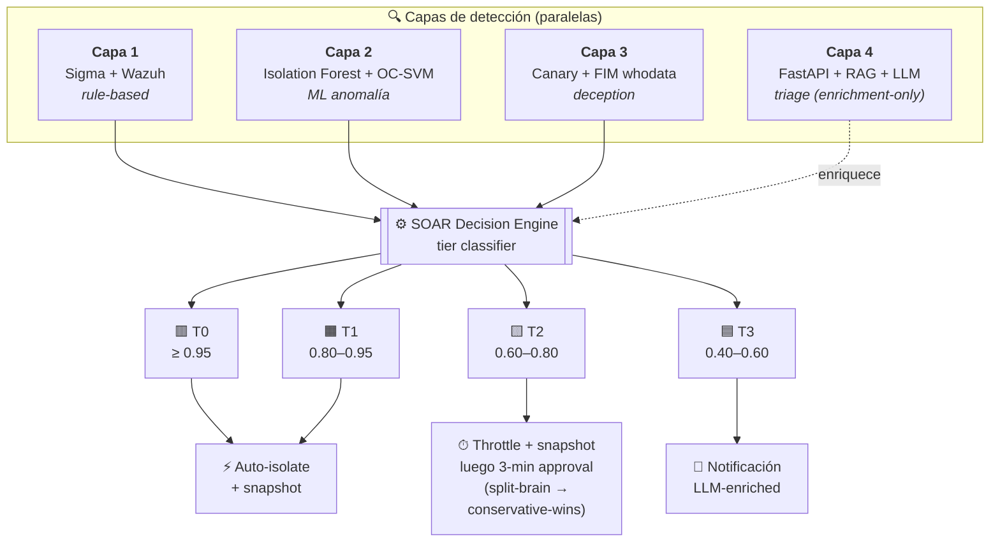

<div align="center">

# ARGOS

### Adaptive Response Guard with Orchestrated Surveillance

*Plataforma multi-vector de detección y respuesta (XDR-style) con defensa en profundidad, SOAR y aprobación humana asistida por LLM. Énfasis primario en ransomware; extendida a Network DoS y Application Abuse per ADR-0008.*

[](docs/PROJECT_STATUS.md)
[](argos_contracts/)
[](pyproject.toml)
[](docs/EVALUATION_CRITERIA.md)
[](LICENSE)

**Activo defendido:** 🛡 PostgreSQL Production DB · **Curso:** Tópicos Avanzados de Ciberseguridad · Universidad de Lima · 2026-1

</div>

---

## ¿Qué es ARGOS?

ARGOS replica la arquitectura de productos comerciales high-end EDR/XDR (Microsoft Defender XDR, CrowdStrike Falcon, Palo Alto Cortex XDR) usando **exclusivamente componentes open source** más una API LLM de bajo costo para la capa de triage. Cuatro capas de detección en paralelo, contención automatizada con flujo de aprobación humana, y resolución visible de split-brain — todo reproducible en un lab virtualizado.

> 📄 **Resumen en 90 segundos:** [`docs/PROJECT_BRIEF.md`](./docs/PROJECT_BRIEF.md)
> 🎨 **Flujo visual con asignación por integrante:** [`docs/architecture/argos_flow.html`](./docs/architecture/argos_flow.html)
> 🏗️ **Arquitectura completa (SAD):** [`docs/architecture/SOLUTION_ARCHITECTURE_DOCUMENT.md`](./docs/architecture/SOLUTION_ARCHITECTURE_DOCUMENT.md)

---

## Por qué importa

| | |
|---|---|
| 🆓 **Réplica open-source de EDR comercial** | Mismas primitivas arquitectónicas que productos pagos (multi-capa + SOAR + LLM triage). Stack 100% OSS excepto una API LLM con budget tope (~\$5/día). Reproducible en cualquier laptop con Vagrant. |
| 👥 **HITL automation con consenso anti-split-brain** | Decisiones multi-aprobador resueltas por *conservative-wins policy* explícita (ADR-0006), no por improvisación. Visible en tiempo real en la Approval Workflow Console. |
| 🤖 **ML contra variantes novel** | Ensemble Isolation Forest + One-Class SVM detecta ransomware que no matchea ninguna regla — el caso donde las defensas signature-only se quedan ciegas. |
| 🍯 **Capa de deception con propiedad zero-FP** | Canary files con FIM whodata atrapan al atacante *antes* de que toque datos reales. Por diseño: un usuario legítimo nunca toca un honeypot. |
| 🌐 **Soberanía de datos** | Primario US-based (GPT-4o-mini) + fallback local Llama 3.1 (zero-egress). El sistema sigue funcionando sin internet. |

---

## Arquitectura de un vistazo

Cuatro capas de detección paralelas alimentan un SOAR Decision Engine que clasifica alertas en cuatro tiers de confianza (T0–T3) y las enruta a contención automática o a flujo de aprobación humana:



> Thresholds 0.95 / 0.80 / 0.60 / 0.40 son **valores preliminares** pendientes de calibración empírica (ver [Q5 protocol](./docs/decisions/OPEN_QUESTIONS_RESOLUTION.md)).
> Para el flujo completo con asignación por integrante: [`docs/architecture/argos_flow.html`](./docs/architecture/argos_flow.html).

---

## Automatización por tier de confianza (T0–T3)

ADR-0003 hace que la profundidad de automatización sea función de **confianza de detección** × **reversibilidad de la acción**. La misma pipeline de alerta produce cuatro outcomes muy distintos:

| Tier | Disparado por | Acción | Aprobación |
|:----:|---------------|--------|-----------|
| 🟥 **T0** | Canary solo, o capas 1+2+3 corroboran | Aislamiento inmediato + snapshot | Post-facto con botón "Revertir" |
| 🟧 **T1** | Capa 1 + Capa 2 corroboran (sin canary) | Aislamiento inmediato + snapshot | Post-facto con botón "Revertir" |
| 🟨 **T2** | Capa sola con high score | **Throttle + snapshot ahora**, aislamiento full pendiente de aprobación 3-min | Pre-ejecución con timeout |
| 🟦 **T3** | Corroboración baja | Solo notificación enriquecida con LLM | Revisión manual del analista |

**Por qué T2 es interesante.** Ransomware moderno cifra ~25,000 archivos/min. El throttle aplicado durante la ventana de aprobación corta esa tasa ≥80% (objetivo validado en EV-03), acotando el daño incluso si el humano no responde. Si el timeout expira sin respuesta, el sistema auto-ejecuta — no hay escenario donde el atacante le gane al reloj.

**Split-brain (conflicto multi-aprobador)** se resuelve con *conservative-wins policy* + ventana de consolidación de 60s: cualquier "approve" gana sobre rechazos, excepto para acciones irreversibles que requieren two-person rule. Ver [ADR-0006](./docs/decisions/0006-split-brain-resolution.md).

---

## Resiliencia por diseño

ARGOS asume que el atacante apuntará al defensor mismo:

- **El LLM nunca está en el path crítico de containment.** Si OpenAI cae, alucina, o el endpoint responde basura, las capas 1–3 + el SOAR siguen funcionando. El LLM Triage solo enriquece la vista del analista.
- **Inferencia local como fallback genuino.** Llama 3.1 8B vía Ollama mantiene el análisis activo aun en deployment air-gapped (per ADR-0001 v2).
- **El disconnect del agente es señal en sí mismo.** Si un atacante mata el Wazuh agent (T1562.001), la pérdida de heartbeat dispara una alerta crítica dentro de ~60s y activa aislamiento de red — el silencio los delata (R-04).
- **Tres capas de detección independientes.** Sigma rules, ML anomaly y canaries fallan independientemente. No hay un solo componente cuya caída produzca ceguera total.
- **Conservative-wins en conflicto multi-aprobador.** Una cuenta de aprobador comprometida no puede vetar unilateralmente una contención legítima — cualquier otro "approve" sobrescribe el "reject" (ADR-0006).

Threat model STRIDE + FMEA completo con ~50 amenazas analizadas: [`docs/architecture/THREAT_MODEL.md`](./docs/architecture/THREAT_MODEL.md).

---

## Stack tecnológico

<table>
<tr>
<td valign="top" width="50%">

**🔍 Detección & SIEM**
- Wazuh 4.7 · OpenSearch · Sigma
- Sysmon · auditd

**🎯 Simulación de ataque multi-vector**
- Atomic Red Team · Caldera
- Custom ransomware simulator (Python)
- DDoS: hping3 · slowhttptest (per UC-06)
- SQL injection: sqlmap (per UC-08)
- pgAudit para query patterns (per UC-07)

**🤖 Machine Learning**
- scikit-learn (Isolation Forest, One-Class SVM)
- scipy (Shannon entropy)

</td>
<td valign="top">

**⚙️ Backend services**
- FastAPI · Redis · APScheduler · Pydantic v2 · PyJWT

**🛡 LLM Triage** (per ADR-0001 v2)
- OpenAI GPT-4o-mini (primario, US-based)
- Llama 3.1 8B local vía Ollama (fallback, zero-egress)
- BGE-large embeddings · mini-RAG (BM25 + RRF)

**📺 UI**
- Streamlit · OpenSearch Dashboards

**🏗 Infra**
- Vagrant · VirtualBox · Terraform (opcional Azure)

</td>
</tr>
</table>

---

## Equipo y responsabilidades

> Para el detalle visual con asignación por componente: [`docs/architecture/argos_flow.html`](./docs/architecture/argos_flow.html)

| | Integrante | Rol | Alcance principal |
|:--:|---|---|---|
| 🟣 | **Enzo Ordoñez Flores** | P1 · Líder · LLM/SOAR | `argos_contracts` (entregado), Capa 4 LLM Triage, motor SOAR + Tier Classifier, Approval API con JWT, notificaciones multi-canal, Consola de Aprobación, simulador de ransomware, playbooks de containment, coordinación general |
| 🔵 | **Sebastian Montenegro** | P2 · Ingeniero ML | Capa 2 (Isolation Forest + One-Class SVM), feature extraction, calibración de tier thresholds, métricas A/B/C (P/R/F1, MITRE coverage, ablation), captura forense |
| 🟠 | **Angeles Castillo** | P3 · Detección · Engaño | Capa 1 (Sigma rules mapeadas a MITRE), Capa 3 (canary FIM + whodata), validación con Atomic Red Team y Caldera, bonus: PRs upstream a SigmaHQ |
| 🟢 | **Diego Jara** | P4 · Infraestructura · UI | Vagrantfile + Wazuh/OpenSearch deployment, PostgreSQL provisioning con datos sintéticos, UI Streamlit base, grabación y edición del video demo |

---

## Estado actual

| Componente | Estado | Notas |
|---|:---:|---|
| 📐 Arquitectura & diseño (SAD, threat model, 13 ADRs, contracts spec, use cases) | ✅ | Completo |
| 📦 [`argos_contracts/`](./argos_contracts/) — Pydantic v2 cross-team | ✅ | **v1.1.0** · 25 modelos · 9 enums · **69 tests** · TD-01 y TD-02 cerrados |
| 🎨 [`docs/architecture/argos_flow.html`](./docs/architecture/argos_flow.html) — flujo + ownership | ✅ | Entregado al equipo |
| 🛡 PostgreSQL como activo defendido (UC-04) | ✅ | Documentado en `OPEN_QUESTIONS §Q2` |
| 🔍 Capa 1 (Sigma + Wazuh) | 🚧 | Pendiente |
| 🤖 Capa 2 (ML anomaly) | 🚧 | Pendiente |
| 🍯 Capa 3 (Canary FIM) | 🚧 | Pendiente |
| 🧠 Capa 4 (LLM Triage) | 🚧 | Esqueletos + TODOs (OpenAI + Llama stubs) |
| ⚙️ Motor SOAR + Approval API | 🚧 | **Fase 2 entregada**: tier router, notificaciones Telegram/Discord/Twilio, Approval API, two-person + conservative-wins, ventana 60s (84 tests soar, cobertura 99%, `tier_router.py` 100%, ADR-0011). Fase 3 en curso: playbooks, consumer, scheduler, hook LLM, audit, JWT (ADR-0012/0013) |
| 🏗 Lab Vagrant + Wazuh deployment | 🚧 | Pendiente |
| 🎯 Simulador de ransomware | 🚧 | Pendiente |
| 📺 UI Streamlit + Approval Console | 🚧 | Pendiente |
| 📊 Evaluación + métricas | 🚧 | Pendiente |
| 🎬 Video demo + exposición | 🚧 | Pendiente |

> **Honest status snapshot detallado:** [`docs/PROJECT_STATUS.md`](./docs/PROJECT_STATUS.md)

---

## Quick start

Los contratos y la Fase 2 del SOAR son ejecutables hoy. El resto de capas está en esqueleto o pendiente.

```bash
git clone https://github.com/EnzoOrdonez/argos.git
cd argos

# Suite global (166 tests: contracts + SOAR Fase 2 + llm_triage)
pip install -e ".[soar,llm,dev]"
pytest -q
```

Los 69 tests bloquean las interfaces inter-capa (alerts, ML scores, triage I/O, incidents, approvals) para que los cuatro work-streams puedan implementar en paralelo sin fricción de integración.

<details>
<summary><b>Setup completo del lab (pendiente)</b></summary>

```bash
# Copiar plantilla de variables y completar valores reales
cp .env.example .env

# Provisioning del lab (Wazuh manager + Windows VM + Linux VM + PostgreSQL)
cd lab
vagrant up   # ~15 min primera vez

# Orquestación de servicios
docker compose up -d   # compose file por entregar
```

</details>

<details>
<summary><b>Variables de entorno requeridas</b> (ver <code>.env.example</code> completo)</summary>

Agrupadas por componente:

- **Wazuh:** `WAZUH_API_URL`, `WAZUH_API_USER`, `WAZUH_API_PASSWORD`
- **OpenSearch:** `OPENSEARCH_URL`, `OPENSEARCH_USER`, `OPENSEARCH_PASSWORD`
- **Redis:** `REDIS_HOST`, `REDIS_PORT`, `REDIS_PASSWORD`
- **PostgreSQL (activo defendido):** `POSTGRES_HOST`, `POSTGRES_DB`, `POSTGRES_USER`, `POSTGRES_PASSWORD`
- **LLM Triage (ADR-0001 v2):** `LLM_BACKEND` (openai/llama_local), `OPENAI_API_KEY`, `OLLAMA_BASE_URL`, `LLM_DAILY_BUDGET_USD`
- **Approval flow:** `JWT_SECRET`, `APPROVAL_T2_TIMEOUT_SECONDS=180`, `APPROVAL_CONSOLIDATION_WINDOW_SECONDS=60`
- **Notificaciones (ADR-0007 v2):** `TELEGRAM_BOT_TOKEN`, `DISCORD_WEBHOOK_URL`, `TWILIO_ACCOUNT_SID`, `SMTP_*` (post-facto)
- **Lab:** `LAB_VICTIM_WINDOWS_IP`, `LAB_VICTIM_LINUX_IP`, `LAB_MANAGER_IP`

</details>

---

## Escenarios de demo

Cinco escenarios end-to-end de ataque diseñados para la exposición en vivo (~13 min total). TTPs completos, guiones de narración y criterios de éxito en [`docs/use-cases/USE_CASES.md`](./docs/use-cases/USE_CASES.md).

| UC | Escenario | Tier | Capas | Foco del demo |
|:--:|-----------|:----:|:----:|--------------|
| **UC-01** | Ransomware clásico (LockBit-like) | T0 | 1 + 2 + 3 | Full-stack end-to-end, email post-facto |
| **UC-02** | Deception por canary | T0 | 3 sola | Detección ultra-temprana, **zero archivos reales cifrados** |
| ⭐ **UC-03** | Variante novel + split-brain | T2 | 2 sola | **Centerpiece:** ML atrapa lo que las reglas no · 4-aprobador split-brain · conservative-wins en vivo |
| **UC-04** | PostgreSQL en producción (two-person rule) | T1 | 1 + 2 | Vocabulario de compliance · four-eyes principle · governance |
| **UC-05** | Ataque stealth (agent-kill attempt) | T0 | 1 + 3 + heartbeat | Resiliencia: agent disconnect = signal |

**Técnicas MITRE ATT&CK en alcance:** T1486 · T1490 · T1083 · T1562 · T1021 · T1071.

---

## Documentación

| 📂 | Topic | Documento |
|:--:|-------|-----------|
| 📄 | Resumen 90 segundos | [`docs/PROJECT_BRIEF.md`](./docs/PROJECT_BRIEF.md) |
| 👥 | Onboarding del equipo | [`docs/CONTEXT.md`](./docs/CONTEXT.md) |
| 🏗 | Arquitectura completa (SAD) | [`docs/architecture/SOLUTION_ARCHITECTURE_DOCUMENT.md`](./docs/architecture/SOLUTION_ARCHITECTURE_DOCUMENT.md) |
| 🎨 | Flujo + asignación por integrante | [`docs/architecture/argos_flow.html`](./docs/architecture/argos_flow.html) · [`.drawio`](./docs/architecture/argos_flow.drawio) |
| 📐 | Cross-team contracts spec | [`docs/architecture/CONTRACTS_SPECIFICATION.md`](./docs/architecture/CONTRACTS_SPECIFICATION.md) |
| 🛡 | Threat model (STRIDE + FMEA) | [`docs/architecture/THREAT_MODEL.md`](./docs/architecture/THREAT_MODEL.md) |
| 🔒 | LLM data handling + sanitization | [`docs/data-handling.md`](./docs/data-handling.md) |
| 📋 | Rúbrica del curso + deliverables | [`docs/EVALUATION_CRITERIA.md`](./docs/EVALUATION_CRITERIA.md) |
| 📊 | Status honesto (shipped vs documentado) | [`docs/PROJECT_STATUS.md`](./docs/PROJECT_STATUS.md) |
| 🧠 | Architecture decisions (13 ADRs) | [`docs/decisions/`](./docs/decisions/) |
| 🎬 | Use cases & escenarios demo | [`docs/use-cases/USE_CASES.md`](./docs/use-cases/USE_CASES.md) |

---

## Estructura del repo

<details>
<summary><b>Click para expandir</b></summary>

```
argos/
├── README.md                  # Este archivo
├── LICENSE                    # MIT
├── .env.example               # Plantilla de variables
├── pyproject.toml             # Metadata + extras por módulo + tooling
│
├── argos_contracts/           # Cross-team Pydantic v2 contracts (entregado · v1.1.0)
│   ├── _mitre_data.py         #     Set curado de ~40 técnicas MITRE
│   ├── alert.py               #     WazuhAlert, NormalizedAlert
│   ├── ml_score.py            #     MLFeatures, MLScore
│   ├── triage.py              #     AlertContext, TriageResponse, MITRE_WHITELIST
│   ├── incident.py            #     Incident (HostInfo tipado), FinalDecision (Literal types)
│   ├── approval.py            #     ApprovalRequest, ApprovalResponse (JWT)
│   ├── enums.py               #     Tier, Severity, NotificationChannelType, ...
│   └── tests/                 #     69 validation tests
│
├── llm_triage/                # Capa 4 — FastAPI + RAG + LLM client (esqueleto)
│   ├── api/                   #     POST /triage endpoint
│   ├── llm_client/            #     OpenAI primary + Llama local fallback (ADR-0001 v2)
│   ├── prompts/               #     Jinja2 templates
│   └── rag/                   #     BM25 + BGE-large + RRF
│
├── docs/                      # Toda la documentación arquitectónica
│   ├── architecture/
│   │   ├── argos_flow.html    #     Flujo + ownership (navegador)
│   │   ├── argos_flow.drawio  #     Mismo flujo editable en draw.io
│   │   └── ...
│   └── decisions/             #     13 ADRs + OPEN_QUESTIONS_RESOLUTION
│
├── lab/                       # Vagrant + Terraform IaC + PostgreSQL provisioning
├── detection/                 # Sigma rules + Wazuh decoders
├── ml/                        # Capa 2 ML pipeline + consumer
├── deception/                 # Canary generator + FIM configs
├── soar/                      # Decision Engine + tier classifier + playbooks
├── ui/                        # Streamlit dashboards + Approval Workflow Console
├── attack-simulation/         # Ransomware simulator + Atomic Red Team wrappers
└── evaluation/                # Métricas, datasets, reportes
```

</details>

---

## Hito siguiente

🎯 **Entrega final: 28 de junio de 2026** (prórroga del profesor, 2026-06-10): informe técnico + demo en vivo + presentación. Los triggers de fallback de ADR-0010 §5 se recalculan contra esta fecha: T-21 = 7-jun (vencido), T-14 = 14-jun, T-10 = 18-jun, T-7 = 21-jun.

El alcance se va recortando según el orden documentado en [`docs/PROJECT_STATUS.md §4`](./docs/PROJECT_STATUS.md) si la presión de calendario lo exige. UC-01 + UC-02 + UC-04 son los irrenunciables del demo.

---

## Licencia

MIT — © 2026 Enzo Ordoñez Flores. Repositorio privado durante el curso; público al cierre.

---

## Agradecimientos

[SigmaHQ](https://github.com/SigmaHQ/sigma) por el formato Sigma abierto · [MITRE ATT&CK](https://attack.mitre.org/) por la taxonomía de amenazas · [Wazuh](https://wazuh.com/) por el SIEM/HIDS open-source · [Atomic Red Team](https://github.com/redcanaryco/atomic-red-team) y [MITRE Caldera](https://github.com/mitre/caldera) por adversary emulation · [Ollama](https://ollama.com/) por inferencia local accesible.
