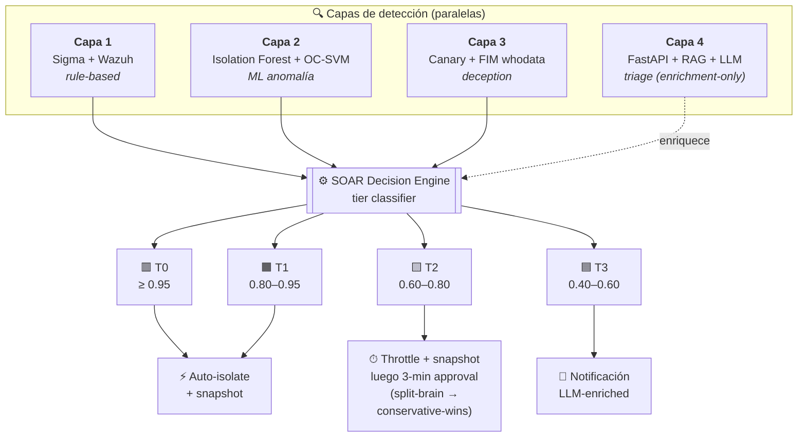

<div align="center">

# ARGOS

### Adaptive Response Guard with Orchestrated Surveillance

*Plataforma multi-vector de detección y respuesta (XDR-style) con defensa en profundidad, SOAR y aprobación humana asistida por LLM. Énfasis primario en ransomware; extendida a Network DoS y Application Abuse per ADR-0008.*

[](docs/ARGOS_RUNBOOK_MAESTRO.html)
[](argos_contracts/)
[](pyproject.toml)
[](docs/EVALUATION_CRITERIA.md)
[](LICENSE)

**Activo defendido:** 🛡 PostgreSQL Production DB · **Curso:** Tópicos Avanzados de Ciberseguridad · Universidad de Lima · 2026-1

</div>

---

## ¿Qué es ARGOS?

ARGOS replica la arquitectura de productos comerciales high-end EDR/XDR (Microsoft Defender XDR, CrowdStrike Falcon, Palo Alto Cortex XDR) usando **exclusivamente componentes open source** más una API LLM de bajo costo para la capa de triage. Cuatro capas de detección en paralelo, contención automatizada con flujo de aprobación humana, y resolución visible de split-brain — todo reproducible en un lab virtualizado.

> 📄 **Resumen en 90 segundos:** [`docs/PROJECT_BRIEF.md`](./docs/PROJECT_BRIEF.md)
> 🎨 **Flujo visual con asignación por integrante:** [`docs/architecture/argos_flow.html`](./docs/architecture/argos_flow.html)
> 🏗️ **Arquitectura completa (SAD):** [`docs/architecture/SOLUTION_ARCHITECTURE_DOCUMENT.md`](./docs/architecture/SOLUTION_ARCHITECTURE_DOCUMENT.md)

---

## Por qué importa

| | |
|---|---|
| 🆓 **Réplica open-source de EDR comercial** | Mismas primitivas arquitectónicas que productos pagos (multi-capa + SOAR + LLM triage). Stack 100% OSS excepto una API LLM con budget tope (~\$5/día). Reproducible en cualquier laptop con Vagrant. |
| 👥 **HITL automation con consenso anti-split-brain** | Decisiones multi-aprobador resueltas por *conservative-wins policy* explícita (ADR-0006), no por improvisación. Visible en tiempo real en la Approval Workflow Console. |
| 🤖 **ML contra variantes novel** | Ensemble Isolation Forest + One-Class SVM detecta ransomware que no matchea ninguna regla — el caso donde las defensas signature-only se quedan ciegas. |
| 🍯 **Capa de deception con propiedad zero-FP** | Canary files con FIM whodata atrapan al atacante *antes* de que toque datos reales. Por diseño: un usuario legítimo nunca toca un honeypot. |
| 🌐 **Soberanía de datos** | El dato va a **NVIDIA NIM** (jurisdicción US), no a proveedores PRC, aunque los modelos sean open-weights de origen chino (`deepseek-v4-pro`/`kimi-k2.6`): procedencia del modelo ≠ jurisdicción del dato. + data sintética + sanitizer T-030. Fallback Ollama (diferido) = zero-egress real (ADR-0001 v3). |

---

## Arquitectura de un vistazo

Cuatro capas de detección paralelas alimentan un SOAR Decision Engine que clasifica alertas en cuatro tiers de confianza (T0–T3) y las enruta a contención automática o a flujo de aprobación humana:



> Thresholds 0.95 / 0.80 / 0.60 / 0.40 son **valores preliminares** pendientes de calibración empírica (ver [Q5 protocol](./docs/decisions/OPEN_QUESTIONS_RESOLUTION.md)).
> Para el flujo completo con asignación por integrante: [`docs/architecture/argos_flow.html`](./docs/architecture/argos_flow.html).

---

## Automatización por tier de confianza (T0–T3)

ADR-0003 hace que la profundidad de automatización sea función de **confianza de detección** × **reversibilidad de la acción**. La misma pipeline de alerta produce cuatro outcomes muy distintos:

| Tier | Disparado por | Acción | Aprobación |
|:----:|---------------|--------|-----------|
| 🟥 **T0** | Canary solo, o capas 1+2+3 corroboran | Aislamiento inmediato + snapshot | Post-facto con botón "Revertir" |
| 🟧 **T1** | Capa 1 + Capa 2 corroboran (sin canary) | Aislamiento inmediato + snapshot | Post-facto con botón "Revertir" |
| 🟨 **T2** | Capa sola con high score | **Throttle + snapshot ahora**, aislamiento full pendiente de aprobación 3-min | Pre-ejecución con timeout |
| 🟦 **T3** | Corroboración baja | Solo notificación enriquecida con LLM | Revisión manual del analista |

**Por qué T2 es interesante.** Ransomware moderno cifra ~25,000 archivos/min. El throttle aplicado durante la ventana de aprobación corta esa tasa ≥80% (objetivo validado en EV-03), acotando el daño incluso si el humano no responde. Si el timeout expira sin respuesta, el sistema auto-ejecuta — no hay escenario donde el atacante le gane al reloj.

**Split-brain (conflicto multi-aprobador)** se resuelve con *conservative-wins policy* + ventana de consolidación de 60s: cualquier "approve" gana sobre rechazos, excepto para acciones irreversibles que requieren two-person rule. Ver [ADR-0006](./docs/decisions/0006-split-brain-resolution.md).

---

## Resiliencia por diseño

ARGOS asume que el atacante apuntará al defensor mismo:

- **El LLM nunca está en el path crítico de containment (R-2).** Si el backend LLM cae, alucina, o el endpoint responde basura, las capas 1–3 + el SOAR siguen funcionando (fail-soft a `None`). El LLM Triage solo enriquece la vista del analista.
- **Inferencia local como fallback genuino (diferido).** Llama 3.1 8B vía Ollama mantendría el análisis activo aun en deployment air-gapped (zero-egress real para PII); aún no cableado (ADR-0001 v3).
- **El disconnect del agente es señal en sí mismo.** Si un atacante mata el Wazuh agent (T1562.001), la pérdida de heartbeat dispara una alerta crítica dentro de ~60s y activa aislamiento de red — el silencio los delata (R-04).
- **Tres capas de detección independientes.** Sigma rules, ML anomaly y canaries fallan independientemente. No hay un solo componente cuya caída produzca ceguera total.
- **Conservative-wins en conflicto multi-aprobador.** Una cuenta de aprobador comprometida no puede vetar unilateralmente una contención legítima — cualquier otro "approve" sobrescribe el "reject" (ADR-0006).

Threat model STRIDE + FMEA completo con ~50 amenazas analizadas: [`docs/architecture/THREAT_MODEL.md`](./docs/architecture/THREAT_MODEL.md).

---

## Stack tecnológico

<table>
<tr>
<td valign="top" width="50%">

**🔍 Detección & SIEM**
- Wazuh 4.7 · OpenSearch · Sigma
- Sysmon · auditd

**🎯 Simulación de ataque multi-vector**
- Atomic Red Team · Caldera
- Custom ransomware simulator (Python)
- DDoS: hping3 · slowhttptest (per UC-06)
- SQL injection: sqlmap (per UC-08)
- pgAudit para query patterns (per UC-07)

**🤖 Machine Learning**
- scikit-learn (Isolation Forest, One-Class SVM)
- scipy (Shannon entropy)

</td>
<td valign="top">

**⚙️ Backend services**
- FastAPI · Redis · APScheduler · Pydantic v2 · PyJWT

**🛡 LLM Triage** (per ADR-0001 v3)
- NVIDIA NIM (SDK OpenAI) — `deepseek-v4-pro` primario, `kimi-k2.6` fallback
- Sanitizer T-030 + MITRE whitelist (anti-alucinación)
- Ollama (Llama 3.1 8B local) = fallback zero-egress, diferido

**📺 UI**
- Consola web (FastAPI, `:8080`) + Streamlit (fallback, `:8501`)
- OpenSearch Dashboards = Perfil B (diferido)

**🏗 Infra**
- Vagrant · VirtualBox · Terraform (opcional Azure)

</td>
</tr>
</table>

---

## Equipo y responsabilidades

> Para el detalle visual con asignación por componente: [`docs/architecture/argos_flow.html`](./docs/architecture/argos_flow.html)

| | Integrante | Rol | Alcance principal |
|:--:|---|---|---|
| 🟣 | **Enzo Ordoñez** | P1 · Líder · LLM/SOAR | `argos_contracts`, Capa 4 LLM Triage (NVIDIA), motor SOAR + Tier Classifier, Approval API con JWT, notificaciones multi-canal, consola web + Streamlit, bridge/live mode, docker-compose, coordinación general |
| 🔵 | **Sebastian Montenegro** | P2 · Ingeniero ML | Capa 2 (Isolation Forest + One-Class SVM), feature extraction, calibración de thresholds, métricas A/B/C (P/R/F1, MITRE coverage), captura forense |
| 🟠 | **Nicole Castillo** | P3 · Detección · Engaño | Capa 1 (Sigma rules mapeadas a MITRE), Capa 3 (canary FIM + whodata), active-response Win+Linux, validación con Atomic Red Team y Caldera |
| 🟢 | **Diego Jara** | P4 · Infraestructura · UI | Lab de 3 VMs + Wazuh manager, PostgreSQL `app_prod`/`argos_audit` con datos sintéticos, ejecución del ataque, grabación del video demo |
| 🟡 | **Yohamin Pimentel** | Apoyo P2 · Forense | Integración forense con **Velociraptor** (`soar/response/forensics/`, recolección post-incidente), apoyo a la Capa 2 |

---

## Estado actual

Prototipo **F1–F6 completo** (413 tests). Leyenda: ✅ hecho (testeado) · 🟡 simulado (corre demo-safe sin lab) · 🔧 pendiente-lab (necesita las VMs).

| Componente | Estado | Notas |
|---|:---:|---|
| 📐 Arquitectura & diseño (SAD, threat model, **15 ADRs**, contracts spec, use cases) | ✅ | Completo |
| 📦 [`argos_contracts/`](./argos_contracts/) — Pydantic v2 cross-team | ✅ | **v1.1.0** · inmutable · contratos sellados |
| ⚙️ SOAR completo (decision engine, tiers, two-person, consolidación, notificaciones, audit, Approval API) | ✅ | ~250 tests · ADR-0011/0012/0013 |
| 🌐 F1 · Live mode (Telegram/ngrok/trigger local) | ✅ | `--live` + `scripts/live_approve.py` |
| 🤖 F2 · Bridge de normalización (`events:normalized`) | ✅🔧 | Camino A Wazuh→`payload` + Camino B publisher ML (ADR-0014). **Scorer ML en vivo = pendiente (P2)** |
| 🛡 F3 · Active-response (Windows + Linux) | ✅🔧 | Scripts `argos-{isolate,throttle,snapshot,kill}` listos; instalación en agentes = pendiente-lab |
| 🧠 F4 · Capa 4 LLM Triage (NVIDIA NIM) | ✅ | `POST /triage` · deepseek/kimi · sanitizer T-030 · fail-soft (R-2) |
| 🐳 F5 · docker-compose Perfil A | ✅ | Core en la VM Linux core · ADR-0015 · `deploy/README.md` |
| 📺 F6 · Consola web + Streamlit fallback | ✅ | `:8080` (web) / `:8501` (streamlit) · read-only |
| 🔍 Capa 1 (Sigma) · 🍯 Capa 3 (Canary FIM) | ✅🔧 | Reglas + simuladores listos; despliegue/auditd en el lab = pendiente-lab |
| 🏗 Lab 3 VMs + ataque real | 🔧 | pendiente-lab (Diego) |
| 🎬 Video demo + exposición | 🟡 | Camino simulado garantizado listo ([`DEMO_RUNBOOK.md`](./DEMO_RUNBOOK.md)) |

> **Manual maestro del equipo (la fuente de verdad):** [`docs/ARGOS_RUNBOOK_MAESTRO.html`](./docs/ARGOS_RUNBOOK_MAESTRO.html) · **status detallado:** [`docs/PROJECT_STATUS.md`](./docs/PROJECT_STATUS.md)

---

## Quick start

El prototipo F1–F6 corre hoy, demo-safe, sin lab.

```bash
git clone https://github.com/EnzoOrdonez/argos.git
cd argos
pip install -e ".[soar,llm,dev,ui]"
pytest -q                          # 413 passing (2 ajenos: charmap de P3, ver troubleshooting del runbook)
```

**Correr el demo (camino simulado, garantizado):**

```bash
# Opción A — docker-compose (todo el core junto):
docker compose up -d                                          # redis, postgres, soar, console, llm-triage
python scripts/demo_injector.py uc04 --redis-url redis://localhost:6379/0
# consola web -> http://localhost:8080

# Opción B — manual (sin Docker para los servicios): ver DEMO_RUNBOOK.md §2
```

> 📘 **Runbook completo (simulado + live + troubleshooting):** [`DEMO_RUNBOOK.md`](./DEMO_RUNBOOK.md)
> 📕 **Manual maestro del equipo (estado, comandos, guion, trampas):** [`docs/ARGOS_RUNBOOK_MAESTRO.html`](./docs/ARGOS_RUNBOOK_MAESTRO.html)

<details>
<summary><b>Prototipo real (3 VMs)</b></summary>

El provisioning del lab (Wazuh manager en la VM core + víctimas Windows/Debian + PostgreSQL) **no vive en `lab/`**
(es un stub); está documentado en **ADR-0015**, [`deploy/README.md`](./deploy/README.md) y
[`detection/p3_deployment_guide.md`](./detection/p3_deployment_guide.md). Swap simulado↔real con
`ARGOS_EXECUTOR=wazuh` + `docker compose --profile real up -d`.

```bash
cp .env.example .env    # completar valores reales (gitignored)
```

</details>

<details>
<summary><b>Variables de entorno requeridas</b> (ver <code>.env.example</code> completo)</summary>

Agrupadas por componente:

- **Wazuh:** `WAZUH_API_URL`, `WAZUH_API_USER`, `WAZUH_API_PASSWORD`
- **OpenSearch:** `OPENSEARCH_URL`, `OPENSEARCH_USER`, `OPENSEARCH_PASSWORD`
- **Redis:** `REDIS_HOST`, `REDIS_PORT`, `REDIS_PASSWORD`
- **PostgreSQL (activo defendido):** `POSTGRES_HOST`, `POSTGRES_DB`, `POSTGRES_USER`, `POSTGRES_PASSWORD`
- **LLM Triage (ADR-0001 v3):** `LLM_BACKEND`, `OPENAI_API_KEY` (key NVIDIA), `OPENAI_BASE_URL`, `OPENAI_MODEL`, `OPENAI_FALLBACK_MODEL`
- **Approval flow:** `JWT_SECRET`, `APPROVAL_T2_TIMEOUT_SECONDS=180`, `APPROVAL_CONSOLIDATION_WINDOW_SECONDS=60`
- **Notificaciones (ADR-0007 v2):** `TELEGRAM_BOT_TOKEN`, `DISCORD_WEBHOOK_URL`, `TWILIO_ACCOUNT_SID`, `SMTP_*` (post-facto)
- **Lab:** `LAB_VICTIM_WINDOWS_IP`, `LAB_VICTIM_LINUX_IP`, `LAB_MANAGER_IP`

</details>

---

## Escenarios de demo

Cinco escenarios end-to-end de ataque diseñados para la exposición en vivo (~13 min total). TTPs completos, guiones de narración y criterios de éxito en [`docs/use-cases/USE_CASES.md`](./docs/use-cases/USE_CASES.md).

| UC | Escenario | Tier | Desenlace | Foco del demo |
|:--:|-----------|:----:|-----------|--------------|
| `uc01` | Ransomware en 3 capas casi simultáneas (T1486) | T0 | EXECUTE_ISOLATION (auto, sub-seg) | Fast-path full-stack |
| `uc02` | Canary sola (Capa 3), zero-FP | T0 | EXECUTE_ISOLATION (auto) | Detección ultra-temprana · **zero archivos cifrados** |
| `uc04` | Ataque a la DB del banco (L1+L2) | T1 | EXECUTE_ISOLATION | **two-person rule** · four-eyes · matriz de decisión |
| `uc06` | DDoS volumétrico (T1498), fast-path | T0 | EXECUTE_ISOLATION (auto) | Contención en el edge |
| `uc07` | SELECT masivo legítimo | — | **NO_ACTION** (el humano rechaza) | El HITL atrapa un **falso positivo** |

**Técnicas MITRE ATT&CK en alcance:** T1486 (ransomware) · T1498 (DDoS) · T1005/T1213 (DB) · T1562 (agent-kill) · T1083. Detalle por UC en [`docs/use-cases/USE_CASES.md`](./docs/use-cases/USE_CASES.md).

---

## Documentación

| 📂 | Topic | Documento |
|:--:|-------|-----------|
| 📄 | Resumen 90 segundos | [`docs/PROJECT_BRIEF.md`](./docs/PROJECT_BRIEF.md) |
| 👥 | Onboarding del equipo | [`docs/CONTEXT.md`](./docs/CONTEXT.md) |
| 🏗 | Arquitectura completa (SAD) | [`docs/architecture/SOLUTION_ARCHITECTURE_DOCUMENT.md`](./docs/architecture/SOLUTION_ARCHITECTURE_DOCUMENT.md) |
| 🎨 | Flujo + asignación por integrante | [`docs/architecture/argos_flow.html`](./docs/architecture/argos_flow.html) · [`.drawio`](./docs/architecture/argos_flow.drawio) |
| 📐 | Cross-team contracts spec | [`docs/architecture/CONTRACTS_SPECIFICATION.md`](./docs/architecture/CONTRACTS_SPECIFICATION.md) |
| 🛡 | Threat model (STRIDE + FMEA) | [`docs/architecture/THREAT_MODEL.md`](./docs/architecture/THREAT_MODEL.md) |
| 🔒 | LLM data handling + sanitization | [`docs/data-handling.md`](./docs/data-handling.md) |
| 📋 | Rúbrica del curso + deliverables | [`docs/EVALUATION_CRITERIA.md`](./docs/EVALUATION_CRITERIA.md) |
| 📊 | Status honesto (shipped vs documentado) | [`docs/PROJECT_STATUS.md`](./docs/PROJECT_STATUS.md) |
| 🧠 | Architecture decisions (15 ADRs) | [`docs/decisions/`](./docs/decisions/) |
| 🎬 | Use cases & escenarios demo | [`docs/use-cases/USE_CASES.md`](./docs/use-cases/USE_CASES.md) |

---

## Estructura del repo

<details>
<summary><b>Click para expandir</b></summary>

```
argos/
├── README.md                  # Este archivo
├── LICENSE                    # MIT
├── .env.example               # Plantilla de variables
├── pyproject.toml             # Metadata + extras por módulo + tooling
├── docker-compose.yml         # F5 · core Perfil A (+ perfiles real/fallback)
├── Dockerfile                 # Imagen única de los servicios
│
├── argos_contracts/           # Cross-team Pydantic v2 contracts (inmutable · v1.1.0)
├── llm_triage/                # Capa 4 — FastAPI + LLM client (NVIDIA NIM) + sanitizer T-030
│   ├── api/                   #     POST /triage endpoint
│   ├── llm_client/            #     OpenAI SDK -> NVIDIA (deepseek/kimi) + Ollama stub (ADR-0001 v3)
│   ├── prompts/               #     Jinja2 templates
│   └── rag/                   #     BM25 + BGE-large + RRF
│
├── soar/                      # SOAR completo: decision engine, tiers, Approval API, audit, forensics
├── bridge/                    # F2 · Wazuh/ML -> events:normalized (ADR-0014)
├── detection/                 # Capa 1 · Sigma rules + simuladores de ataque (P3)
├── active-response/           # F3 · scripts argos-* (linux/ bash + windows/ PowerShell)
├── ml/                        # Capa 2 · ML pipeline (scorer en vivo pendiente)
├── deception/                 # Capa 3 · canary generator + FIM/auditd configs
├── console/                   # F6 · consola web read-only (FastAPI + SPA)
├── ui/                        # Consola Streamlit (fallback)
├── deploy/                    # F5 · runbook del compose + tests estructurales
├── scripts/                   # demo_injector, live_approve, triage_stub
│
├── docs/                      # Documentación arquitectónica
│   ├── ARGOS_RUNBOOK_MAESTRO.html  # Manual maestro del equipo (fuente de verdad)
│   ├── architecture/          #     SAD, threat model, flujo + ownership
│   └── decisions/             #     15 ADRs + OPEN_QUESTIONS_RESOLUTION
│
├── lab/                       # (stub) provisioning real en ADR-0015 / deploy/README / p3_deployment_guide
├── attack-simulation/         # Wrappers de emulación adversaria
└── evaluation/                # Métricas, datasets, reportes
```

</details>

---

## Hito siguiente

🎯 **Entrega final: 28 de junio de 2026** (prórroga del profesor, 2026-06-10): informe técnico + demo en vivo + presentación. Los triggers de fallback de ADR-0010 §5 se recalculan contra esta fecha: T-21 = 7-jun (vencido), T-14 = 14-jun, T-10 = 18-jun, T-7 = 21-jun.

El alcance se va recortando según el orden documentado en [`docs/PROJECT_STATUS.md §4`](./docs/PROJECT_STATUS.md) si la presión de calendario lo exige. UC-01 + UC-02 + UC-04 son los irrenunciables del demo.

---

## Licencia

MIT — © 2026 Enzo Ordoñez. Repositorio privado durante el curso; público al cierre.

---

## Agradecimientos

[SigmaHQ](https://github.com/SigmaHQ/sigma) por el formato Sigma abierto · [MITRE ATT&CK](https://attack.mitre.org/) por la taxonomía de amenazas · [Wazuh](https://wazuh.com/) por el SIEM/HIDS open-source · [Atomic Red Team](https://github.com/redcanaryco/atomic-red-team) y [MITRE Caldera](https://github.com/mitre/caldera) por adversary emulation · [Ollama](https://ollama.com/) por inferencia local accesible.
