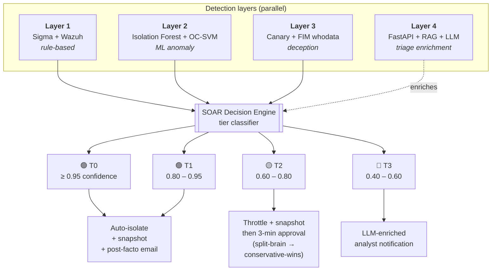

# ARGOS

**Adaptive Ransomware Guard with Orchestrated Surveillance**

A defense-in-depth ransomware detection and response system combining rule-based detection (Sigma + Wazuh), ML anomaly detection, deception (canary files), and LLM-assisted triage with human-in-the-loop SOAR.

> 🎓 Tópicos Avanzados de Ciberseguridad · Universidad de Lima · 2026-1

---

## Status

🚧 **In active development** — Architecture and design phase complete. **Week 2 contracts layer shipped** ([`argos_contracts/`](./argos_contracts/), 59 validation tests). Layers 1–4 implementation in progress.

---

## What is ARGOS?

ARGOS replicates the architecture of commercial high-end EDR/XDR products (Microsoft Defender XDR, CrowdStrike Falcon, Palo Alto Cortex XDR) using exclusively open-source components plus a low-cost LLM API for the triage layer. It demonstrates four parallel detection layers, automated containment with human approval flow, and visible split-brain resolution — all in a reproducible lab environment.

**For the full vision in 90 seconds:** see [`docs/PROJECT_BRIEF.md`](./docs/PROJECT_BRIEF.md).

---

## Why this matters

- **Open-source replica of commercial EDR.** Same architectural primitives as paid products (multi-layer + SOAR + LLM triage), 100% OSS stack except for a budget-capped LLM API (~$5/day). Reproducible on any laptop with Vagrant.
- **HITL automation with split-brain consensus.** Multi-approver decisions resolved by an explicit *conservative-wins* policy (ADR-0006), not improvisation. Visible in real-time on the Approval Workflow Console.
- **ML against novel variants.** Isolation Forest + One-Class SVM ensemble detects ransomware that doesn't match any rule — the case where signature-only defenses go silent.
- **Deception layer with zero-FP property.** Canary files with FIM whodata catch attackers *before* they reach real data. By design: a legitimate user never touches a honeypot.

---

## Architecture at a glance

Four parallel detection layers feed a SOAR Decision Engine that classifies alerts into four confidence tiers (T0–T3) and routes them to either automated containment or a human approval flow:



For the complete architecture: [`docs/architecture/SOLUTION_ARCHITECTURE_DOCUMENT.md`](./docs/architecture/SOLUTION_ARCHITECTURE_DOCUMENT.md).
For an interactive view (zoom, pan, hover): open [`docs/architecture/architecture_diagram.html`](./docs/architecture/architecture_diagram.html) locally.

---

## Confidence-tiered automation (T0–T3)

ADR-0003 makes automation depth a function of *detection confidence* and *action reversibility*. The same alert pipeline produces four very different outcomes:

| Tier | Trigger | Confidence | Action | Approval |
|:----:|---------|:----------:|--------|----------|
| 🟢 **T0** | Canary alone, OR layers 1+2+3 fire together | ≥ 0.95 | Immediate auto-isolation + snapshot | Post-facto with revert button |
| 🟢 **T1** | Layers 1+2 corroborate (no canary) | 0.80 – 0.95 | Immediate auto-isolation + snapshot | Post-facto with revert button |
| 🟡 **T2** | Single layer, high score | 0.60 – 0.80 | **Throttle + snapshot now**, full isolation pending 3-min approval | Pre-execution with timeout |
| 🔵 **T3** | Low corroboration | 0.40 – 0.60 | LLM-enriched notification only | Manual analyst review |

**Why T2 is interesting:** modern ransomware encrypts ~25,000 files/min. The throttle applied during the approval window cuts that rate by ≥80% (target validated by EV-03), bounding damage even if the human is unavailable. If the timeout expires without a response, the system auto-executes — there is no scenario where the attacker outruns the clock.

**Split-brain (multi-approver conflict)** is resolved by a *conservative-wins* policy with a 60s consolidation window: any "approve" wins over rejects, except for irreversible actions which require two-person rule. See [ADR-0006](./docs/decisions/0006-split-brain-resolution.md).

---

## Resilience by design

ARGOS assumes the attacker will target the defender:

- **The LLM is never on the critical containment path.** If DeepSeek hallucinates, returns garbage, or goes offline, layers 1–3 + the SOAR keep working. LLM Triage only enriches the analyst view.
- **Agent disconnect is itself a signal.** If an attacker kills the Wazuh agent (T1562.001), the heartbeat-loss alert fires within ~60s and triggers network-level isolation — the silence betrays them (R-04).
- **Three independent detection layers.** Sigma rules, ML anomaly, and canaries fail independently. There is no single defender component whose compromise produces total blindness.
- **Conservative-wins on multi-approver conflict.** A compromised approver account cannot single-handedly veto a legitimate containment — any other "approve" overrides the reject (ADR-0006).

Full STRIDE + FMEA threat model with ~50 analyzed threats: [`docs/architecture/THREAT_MODEL.md`](./docs/architecture/THREAT_MODEL.md).

---

## Tech stack

**Detection & SIEM:** Wazuh · OpenSearch · Sigma · Sysmon · auditd
**Attack simulation:** Atomic Red Team · Caldera · custom ransomware simulator
**ML:** scikit-learn (Isolation Forest, One-Class SVM)
**Backend services:** FastAPI · Redis · APScheduler · Pydantic v2
**LLM Triage:** DeepSeek-V3 (primary) · Qwen2.5-72B (fallback) · BGE-large embeddings · mini-RAG
**UI:** Streamlit · OpenSearch Dashboards
**Infra:** Vagrant · Terraform (optional Azure)

---

## What's working today

| Module | Status | Notes |
|--------|:------:|-------|
| [`argos_contracts/`](./argos_contracts/) — shared Pydantic v2 models | ✅ shipped | 25 cross-team contracts (9 enums + 16 models/constants). 59 validation tests. UTC-aware timestamps enforced. MITRE whitelist hardens LLM output against hallucination. |
| [`llm-triage/`](./llm-triage/) — Layer 4 (FastAPI + RAG + LLM client) | 🚧 scaffolding | Module skeleton + vendor-agnostic factory pattern. Implementation Weeks 2–8. |
| `lab/`, `detection/`, `ml/`, `deception/`, `soar/`, `ui/`, `attack-simulation/`, `evaluation/` | 📅 planned | See roadmap below. |

---

## Quick start

The contracts module is runnable today. Other layers are scaffolding or pending — full lab provisioning lands in Weeks 2–3.

```bash
# Clone the repo
git clone https://github.com/EnzoOrdonez/argos.git
cd argos

# Run the contracts layer test suite (59 tests)
pip install -r argos_contracts/requirements.txt
pytest argos_contracts/tests/ -v
```

You should see all 59 tests pass — these lock the inter-layer interfaces (alerts, ML scores, triage I/O, incidents, approvals) so the four work-streams can implement in parallel without integration friction.

<details>
<summary><b>Full lab setup (coming Week 2–3)</b></summary>

```bash
# Copy environment template and fill in real values
cp .env.example .env
# Edit .env with your Wazuh, OpenSearch, Redis, LLM, SMTP credentials

# Vagrant lab provisioning
vagrant up   # placeholder — Vagrantfile lands in Week 2

# Service orchestration
docker compose up -d   # placeholder — compose file lands in Week 3
```

</details>

<details>
<summary><b>Required environment variables</b> (see <code>.env.example</code> for the full template)</summary>

Grouped by component:

- **Wazuh:** `WAZUH_API_URL`, `WAZUH_API_USER`, `WAZUH_API_PASSWORD`
- **OpenSearch:** `OPENSEARCH_URL`, `OPENSEARCH_USER`, `OPENSEARCH_PASSWORD`
- **Redis:** `REDIS_HOST`, `REDIS_PORT`, `REDIS_PASSWORD`
- **LLM Triage:** `LLM_BACKEND` (deepseek|qwen), `DEEPSEEK_API_KEY`, `QWEN_API_KEY`, `LLM_DAILY_BUDGET_USD`
- **Approval flow:** `JWT_SECRET`, `APPROVAL_T2_TIMEOUT_SECONDS=180`, `APPROVAL_CONSOLIDATION_WINDOW_SECONDS=60`
- **SMTP:** `SMTP_HOST`, `SMTP_PORT`, `APPROVER_EMAILS` (use [MailHog](https://github.com/mailhog/MailHog) in dev)
- **Lab:** `LAB_VICTIM_WINDOWS_IP`, `LAB_VICTIM_LINUX_IP`, `LAB_MANAGER_IP`

</details>

---

## Demo scenarios

Five end-to-end attack scenarios designed for the live exposition (~13 min total). Full TTPs, narration scripts, and success criteria in [`docs/use-cases/USE_CASES.md`](./docs/use-cases/USE_CASES.md).

| UC | Scenario | Tier | Layers | Demo focus |
|----|----------|:----:|:------:|------------|
| **UC-01** | Classic ransomware (LockBit-like) | T0 | 1 + 2 + 3 | Full-stack end-to-end, post-facto email |
| **UC-02** | Canary deception | T0 | 3 alone | Ultra-early detection, **zero real files encrypted** |
| ⭐ **UC-03** | Novel variant + split-brain | T2 | 2 alone | **Centerpiece:** ML catches what rules can't · 4-approver split-brain · conservative-wins live |
| **UC-04** | Production DB (two-person rule) | T1 | 1 + 2 | Compliance vocabulary · four-eyes principle · governance |
| **UC-05** | Stealth attack (agent-kill attempt) | T0 | 1 + 3 + heartbeat | Resilience: agent disconnect = signal |

**MITRE ATT&CK techniques in scope:** T1486 (Data Encrypted for Impact) · T1490 (Inhibit System Recovery) · T1083 (File Discovery) · T1562 (Impair Defenses) · T1021 (Remote Services) · T1071 (Application Layer Protocol).

---

## Documentation

All architecture, design decisions, threat model, and use cases are in [`docs/`](./docs/):

| Topic | Document |
|-------|----------|
| 📄 90-second overview | [`docs/PROJECT_BRIEF.md`](./docs/PROJECT_BRIEF.md) |
| 👥 Team onboarding | [`docs/CONTEXT.md`](./docs/CONTEXT.md) |
| 🏗️ Full architecture (SAD) | [`docs/architecture/SOLUTION_ARCHITECTURE_DOCUMENT.md`](./docs/architecture/SOLUTION_ARCHITECTURE_DOCUMENT.md) |
| 🎨 Interactive architecture diagram | [`docs/architecture/architecture_diagram.html`](./docs/architecture/architecture_diagram.html) |
| 📐 Cross-team contracts spec | [`docs/architecture/CONTRACTS_SPECIFICATION.md`](./docs/architecture/CONTRACTS_SPECIFICATION.md) |
| 🛡️ Threat model (STRIDE + FMEA) | [`docs/architecture/THREAT_MODEL.md`](./docs/architecture/THREAT_MODEL.md) |
| 🧠 Architecture decisions (7 ADRs) | [`docs/decisions/`](./docs/decisions/) |
| 🎬 Use cases & demo scenarios | [`docs/use-cases/USE_CASES.md`](./docs/use-cases/USE_CASES.md) |

---

## Repository layout

<details>
<summary><b>Click to expand</b></summary>

```
argos/
├── README.md                  # This file
├── LICENSE
├── .env.example               # Environment template
├── pyproject.toml             # mypy + pydantic plugin config
│
├── argos_contracts/           # ✅ Cross-team Pydantic v2 contracts (shipped)
│   ├── alert.py               #     WazuhAlert, NormalizedAlert
│   ├── ml_score.py            #     MLFeatures, MLScore
│   ├── triage.py              #     AlertContext, TriageResponse, MITRE_WHITELIST
│   ├── incident.py            #     Incident state machine, ProposedAction
│   ├── approval.py            #     ApprovalRequest, ApprovalResponse (JWT)
│   ├── enums.py               #     Severity, Tier, Layer, IncidentState, ...
│   └── tests/                 #     59 validation tests
│
├── llm-triage/                # 🚧 Layer 4 — FastAPI + RAG + LLM client (scaffolding)
│   ├── api/                   #     POST /triage endpoint
│   ├── llm_client/            #     Vendor-agnostic: DeepSeek + Qwen via factory
│   ├── prompts/               #     Jinja2 templates (system, user, injection_guard)
│   └── rag/                   #     BM25 → BGE-large → cross-encoder pipeline
│
├── docs/                      # ✅ All architecture & design documentation
│
├── lab/                       # 📅 Vagrant + Terraform IaC
├── detection/                 # 📅 Sigma rules + Wazuh decoders
├── ml/                        # 📅 Layer 2 ML pipeline + consumer
├── deception/                 # 📅 Canary generator + FIM configs
├── soar/                      # 📅 Decision Engine + tier classifier + playbooks
├── ui/                        # 📅 Streamlit dashboards + Approval Workflow Console
├── attack-simulation/         # 📅 Ransomware simulator + Atomic Red Team wrappers
└── evaluation/                # 📅 Metrics, datasets, reports
```

</details>

---

## Team

| Role | Member |
|------|--------|
| Lead · LLM/SOAR · Coordinator | [@EnzoOrdonez](https://github.com/EnzoOrdonez) |
| ML Engineer | TBD |
| Detection Engineer | TBD |
| Infrastructure · UI · Evaluation | TBD |

---

## Roadmap

- ✅ **Week 1:** Architecture & design phase complete (~210 KB of docs, 7 ADRs, threat model, use cases).
- ✅ **Week 2:** Cross-team contracts layer shipped (`argos_contracts/`, 59 tests).
- 🚧 **Weeks 2–9:** Implementation across 4 layers + SOAR + Approval Workflow Console.
  - 🎯 **Gate 1 (Week 5):** Layer 1 functional end-to-end (UC-01 demo possible).
  - 🎯 **Gate 2 (Week 7):** Layers 1+2+3 integrated with SOAR.
  - 🎯 **Gate 3 (Week 9):** Full stack + Layer 4 LLM + approval flow + initial metrics.
- 📅 **Weeks 10–12:** Evaluation runs (EV-01..EV-07) + Sigma rules upstream contributions.
- 📅 **Week 13:** Demo polish + 3-min video recording.
- 📅 **Week 14:** Live exposition.

---

## License

This repository will be released under the **MIT License** at the end of the course (currently private during development).

---

## Acknowledgments

- [SigmaHQ](https://github.com/SigmaHQ/sigma) for the open Sigma rule format.
- [MITRE ATT&CK](https://attack.mitre.org/) for the threat taxonomy.
- [Wazuh](https://wazuh.com/) for the open-source SIEM/HIDS.
- [Atomic Red Team](https://github.com/redcanaryco/atomic-red-team) and [MITRE Caldera](https://github.com/mitre/caldera) for adversary emulation.
